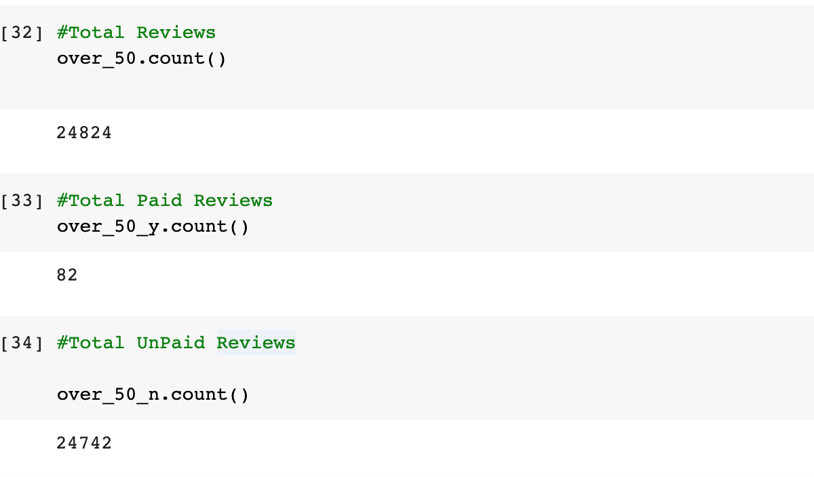

# Amazon_Vine_Analysis

## Overview of the analysis:

The overall objective of this project was to look at Amazon reviews regarding Automative and use Pyspark to peform the ETL process by extracting the data, transforming the data, and connecting to the database that was generated through the AWS webserver. Once the reviews were converted into a dataframe, the goal was to determine if there is favorable review bias from the Vine members in the data set.

## Results: 
The results below show the overall total for each question, the Vine reviews (Paid), and the non-Vine reveiws (Unpaid). 

* How many Vine reviews and non-Vine reviews were there?
 
* How many Vine reviews were 5 stars? How many non-Vine reviews were 5 stars?

* What percentage of Vine reviews were 5 stars? What percentage of non-Vine reviews were 5 stars?
 

## Summary: 
Looking at the results, it is safe to assume that the data does not appear to have a more favorable bias for paid reviews because the total percentage of five-star reviews was 51.7%, which is on par for the Unpaid or non-Vine reviews, 51.8%, and significantly higher (at a 95% confidence level) than the Vine reviews which was only 40.2%. The next step to verify that this holds true for all Vine v Non-Vine reviews would be to analyze another data set from the Amazon Reviews and see if it follows the same pattern and determine any significant differences between Vine Reviews, Non-Vine Reviews, and the Total.  

